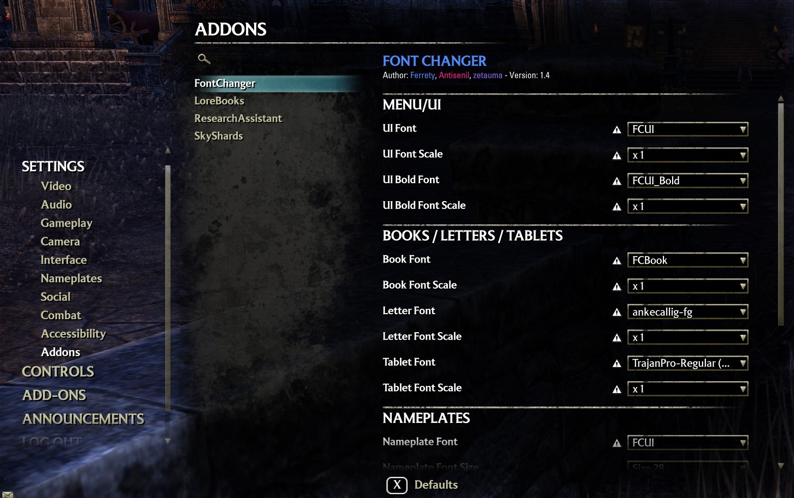
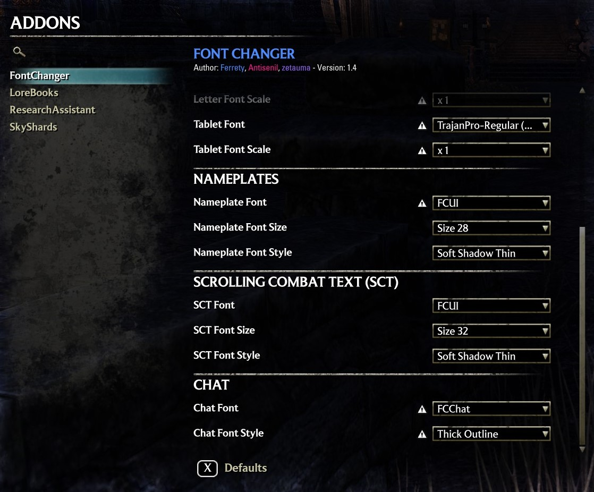

# ESO FontChanger

This is a fork of the [FontChanger](https://www.esoui.com/downloads/fileinfo.php?id=3728) addon by Ferrety (and later modifications by Antisenil)

Primarily, this fork aims to simplify the process of adding new fonts to the addon by providing a batch script to generate the .slug files for you. See detailed instructions below.

It also adds some new options to the addon settings to more easily change the fonts in game.

	
	

## How to add additional fonts
1. Download your desired font in TTF format
2. Copy & Paste into the FontChanger/fonts/ttfs folder
3. Locate `slugfont.exe` in your ESO installation and copy it to FontChanger/fonts. Some common locations are:
	- C:\Program Files\Zenimax Online\The Elder Scrolls Online\game\client\slugfont.exe
	- C:\Program Files (x86)\Zenimax Online\The Elder Scrolls Online\game\client\slugfont.exe
	- C:\Steam\steamapps\common\Zenimax Online\The Elder Scrolls Online\game\client\slugfont.exe
4. Run FontChanger/fonts/slug.bat
	- This will automatically generate .slug files for all the fonts in the ttfs folder and update `CustomFontOptions.lua`
5. Load up the game or run `/reloadui` to see the new fonts in the options menu

